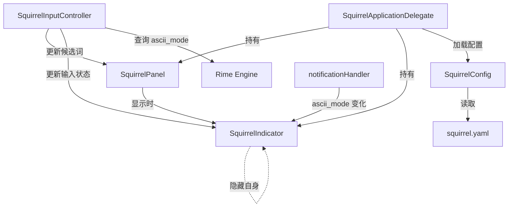

# 设计文档：光标输入状态指示器 (Cursor Input Indicator)

## 概述

本功能为 Squirrel（鼠须管）输入法添加一个轻量级的光标旁常驻输入状态指示器（Indicator）。该指示器以小型浮动窗口的形式，始终显示在光标附近，用不同颜色和文字标签（"中" / "A"）区分中文模式与英文模式，帮助用户随时感知当前 `ascii_mode` 状态。

核心设计原则：
- 复用现有架构模式（参考 `SquirrelPanel` 的浮动窗口实现）
- 最小化对现有代码的侵入
- 通过 `squirrel.yaml` 配置文件控制所有行为和样式

## 架构

### 整体架构

Indicator 作为一个独立的浮动窗口组件，与现有的 `SquirrelPanel`（候选面板）并行存在。两者共享相同的生命周期管理入口（`SquirrelApplicationDelegate` 和 `SquirrelInputController`），但互不干扰。



### 数据流

1. **状态变化触发**：Rime 引擎通过 `notificationHandler` 回调通知 `ascii_mode` 变化
2. **状态传递**：`SquirrelApplicationDelegate` 或 `SquirrelInputController` 将新状态传递给 `SquirrelIndicator`
3. **位置获取**：`SquirrelInputController` 通过 `IMKTextInput.attributes(forCharacterIndex:lineHeightRectangle:)` 获取光标位置，传递给 Indicator
4. **显示/隐藏**：Indicator 根据配置开关、候选面板状态、会话激活状态决定是否显示

## 组件与接口

### 1. SquirrelIndicator（新增类）

核心浮动窗口组件，继承自 `NSPanel`。

```swift
final class SquirrelIndicator: NSPanel {
    /// 当前是否为 ASCII 模式
    private var asciiMode: Bool = false
    
    /// 中文模式颜色
    var chineseColor: NSColor = NSColor(srgbRed: 1.0, green: 0, blue: 0, alpha: 1.0) // 0x0000FF -> RGB(0,0,255) 蓝色
    
    /// 英文模式颜色
    var asciiColor: NSColor = NSColor(srgbRed: 1.0, green: 0.647, blue: 0, alpha: 1.0) // 0x00A5FF -> RGB(255,165,0) 橙色
    
    /// 是否启用
    var enabled: Bool = false
    
    /// 光标位置
    var cursorRect: NSRect = .zero
    
    init()
    
    /// 更新输入模式并刷新显示
    func update(asciiMode: Bool, cursorRect: NSRect)
    
    /// 显示 Indicator
    func show()
    
    /// 隐藏 Indicator
    func hide()
}
```

设计决策：
- 继承 `NSPanel` 并使用 `nonActivatingPanel` 样式，与 `SquirrelPanel` 保持一致的窗口管理模式
- 使用 `ignoresMouseEvents = true` 确保不拦截鼠标事件
- 窗口级别设为 `CGShieldingWindowLevel`（与 `SquirrelPanel` 一致），确保始终在最前
- 窗口尺寸固定为 20x20 像素以内，使用 `NSTextField` 或直接 Core Graphics 绘制文字标签

### 2. SquirrelConfig 扩展

在现有 `SquirrelConfig` 的使用方式基础上，新增以下配置项的读取（无需修改 `SquirrelConfig` 类本身，只需在调用处读取新的 key）：

| 配置路径 | 类型 | 默认值 | 说明 |
|---------|------|--------|------|
| `style/show_input_indicator` | Bool | `false` | 是否显示 Indicator |
| `style/indicator_chinese_color` | Color | `0x0000FF`（蓝色） | 中文模式颜色 |
| `style/indicator_ascii_color` | Color | `0x00A5FF`（橙色） | 英文模式颜色 |

颜色格式复用 `SquirrelConfig.getColor(_:inSpace:)` 方法，支持 `0xAABBGGRR` 和 `0xBBGGRR` 两种格式，以及 `display_p3` / `sRGB` 色彩空间。

### 3. SquirrelApplicationDelegate 修改

```swift
// 新增属性
var indicator: SquirrelIndicator?

// applicationWillFinishLaunching 中初始化
indicator = SquirrelIndicator()

// loadSettings 中加载配置
func loadSettings() {
    // ... 现有代码 ...
    let showIndicator = config?.getBool("style/show_input_indicator") ?? false
    indicator?.enabled = showIndicator
    if showIndicator {
        let colorSpace: SquirrelTheme.RimeColorSpace = .from(name: config?.getString("style/color_space") ?? "")
        indicator?.chineseColor = config?.getColor("style/indicator_chinese_color", inSpace: colorSpace) 
            ?? NSColor(srgbRed: 0, green: 0, blue: 1.0, alpha: 1.0)
        indicator?.asciiColor = config?.getColor("style/indicator_ascii_color", inSpace: colorSpace) 
            ?? NSColor(srgbRed: 1.0, green: 0.647, blue: 0, alpha: 1.0)
    }
}
```

### 4. SquirrelInputController 修改

```swift
// 在 rimeUpdate() 中，获取光标位置后更新 Indicator
func rimeUpdate() {
    // ... 现有代码获取 status 和 ctx ...
    
    // 更新 Indicator
    if let indicator = NSApp.squirrelAppDelegate.indicator, indicator.enabled {
        var inputPos = NSRect()
        client?.attributes(forCharacterIndex: 0, lineHeightRectangle: &inputPos)
        let isAscii = rimeAPI.get_option(session, "ascii_mode")
        indicator.update(asciiMode: isAscii, cursorRect: inputPos)
    }
}

// 在 showPanel 中，当候选面板显示时隐藏 Indicator
func showPanel(...) {
    // ... 现有代码 ...
    if candidates.count > 0 {
        NSApp.squirrelAppDelegate.indicator?.hide()
    }
}

// activateServer 中显示 Indicator
override func activateServer(_ sender: Any!) {
    // ... 现有代码 ...
    if let indicator = NSApp.squirrelAppDelegate.indicator, indicator.enabled {
        let isAscii = rimeAPI.get_option(session, "ascii_mode")
        var inputPos = NSRect()
        client?.attributes(forCharacterIndex: 0, lineHeightRectangle: &inputPos)
        indicator.update(asciiMode: isAscii, cursorRect: inputPos)
    }
}

// deactivateServer 中隐藏 Indicator
override func deactivateServer(_ sender: Any!) {
    NSApp.squirrelAppDelegate.indicator?.hide()
    // ... 现有代码 ...
}
```

### 5. notificationHandler 修改

在现有的 `notificationHandler` 函数中，当检测到 `option` 类型的通知且涉及 `ascii_mode` 时，更新 Indicator：

```swift
// 在 notificationHandler 中
if messageType == "option" {
    // ... 现有代码 ...
    if optionName == "ascii_mode" || optionName == "!ascii_mode" {
        delegate.indicator?.update(asciiMode: state, cursorRect: delegate.indicator?.cursorRect ?? .zero)
    }
}
```

## 数据模型

本功能不引入新的持久化数据模型。运行时状态如下：

### SquirrelIndicator 运行时状态

| 属性 | 类型 | 说明 |
|------|------|------|
| `asciiMode` | `Bool` | 当前是否为英文模式 |
| `enabled` | `Bool` | 是否启用 Indicator |
| `chineseColor` | `NSColor` | 中文模式显示颜色 |
| `asciiColor` | `NSColor` | 英文模式显示颜色 |
| `cursorRect` | `NSRect` | 当前光标位置矩形 |

### 配置数据（squirrel.yaml）

```yaml
style:
  show_input_indicator: true
  indicator_chinese_color: 0x0000FF    # 蓝色 (BGR)
  indicator_ascii_color: 0x00A5FF      # 橙色 (BGR)
```


## Correctness Properties

*A property is a characteristic or behavior that should hold true across all valid executions of a system — essentially, a formal statement about what the system should do. Properties serve as the bridge between human-readable specifications and machine-verifiable correctness guarantees.*

### Property 1: 模式颜色映射正确性

*For any* boolean `asciiMode` 值和任意一对 `(chineseColor, asciiColor)` 配置颜色，当 Indicator 更新为该 `asciiMode` 状态时，其显示颜色应为 `asciiMode == false` 时的 `chineseColor`，或 `asciiMode == true` 时的 `asciiColor`。

**Validates: Requirements 2.3**

### Property 2: 屏幕边界约束

*For any* 光标位置 `cursorRect` 和任意屏幕矩形 `screenRect`，Indicator 计算出的最终窗口 frame 应完全包含在 `screenRect` 内（即 `frame.minX >= screenRect.minX && frame.maxX <= screenRect.maxX && frame.minY >= screenRect.minY && frame.maxY <= screenRect.maxY`）。

**Validates: Requirements 3.3**

### Property 3: 光标右上方偏移定位

*For any* 光标位置 `cursorRect`，当该位置距离屏幕边界足够远（即不触发边界约束）时，Indicator 的窗口 origin 应位于光标矩形的右上方，且与光标保持固定的小间距偏移量。

**Validates: Requirements 3.4**

### Property 4: 窗口尺寸不变量

*For any* `asciiMode` 值和任意配置状态，Indicator 的窗口尺寸（width 和 height）应始终不超过 20 像素。

**Validates: Requirements 5.4**

## 错误处理

| 场景 | 处理策略 |
|------|---------|
| `IMKTextInput` 客户端返回零矩形光标位置 | 隐藏 Indicator，不显示在屏幕左上角 |
| `SquirrelConfig` 中颜色配置格式错误 | `getColor` 返回 `nil`，使用默认颜色 |
| Rime session 为 0（无有效会话） | 不更新 Indicator，保持隐藏 |
| `client` 为 `nil` | 不更新 Indicator，保持隐藏 |
| 多显示器环境下光标跨屏 | 使用包含光标位置的屏幕的 frame 进行边界约束（参考 `SquirrelPanel` 的 `currentScreen()` 逻辑） |

## 测试策略

### 单元测试（Example-based）

覆盖以下场景：
- 配置读取：`show_input_indicator` 为 `true`/`false`/未设置时的行为
- 默认颜色：未配置颜色时使用蓝色和橙色默认值
- 模式标签映射：`asciiMode=false` → "中"，`asciiMode=true` → "A"
- 窗口属性：`nonActivatingPanel` 样式、`ignoresMouseEvents = true`
- 候选面板互斥：候选面板显示时 Indicator 隐藏
- 会话生命周期：`activateServer` 显示、`deactivateServer` 隐藏

### Property-Based 测试

使用 Swift 的 [swift-testing](https://github.com/apple/swift-testing) 框架配合手动随机输入生成（Swift 生态中 PBT 库较少，可使用 `SystemRandomNumberGenerator` 生成随机测试数据）。

每个 property test 运行至少 100 次迭代。

- **Property 1**：生成随机 `asciiMode` 布尔值和随机颜色对，验证颜色映射
  - Tag: `Feature: cursor-input-indicator, Property 1: 模式颜色映射正确性`
- **Property 2**：生成随机 `cursorRect`（包括屏幕边缘和超出边界的位置）和随机 `screenRect`，验证最终 frame 在屏幕内
  - Tag: `Feature: cursor-input-indicator, Property 2: 屏幕边界约束`
- **Property 3**：生成随机 `cursorRect`（限制在屏幕内部足够远的位置），验证 Indicator 在光标右上方固定偏移处
  - Tag: `Feature: cursor-input-indicator, Property 3: 光标右上方偏移定位`
- **Property 4**：生成随机 `asciiMode` 和随机配置，验证窗口尺寸 <= 20x20
  - Tag: `Feature: cursor-input-indicator, Property 4: 窗口尺寸不变量`

### 集成测试

- 通知回调流程：模拟 `notificationHandler` 收到 `ascii_mode` 变化，验证 Indicator 状态更新
- 完整生命周期：`activateServer` → 输入 → 切换模式 → 显示候选 → 隐藏 Indicator → 候选消失 → 恢复 Indicator → `deactivateServer`
